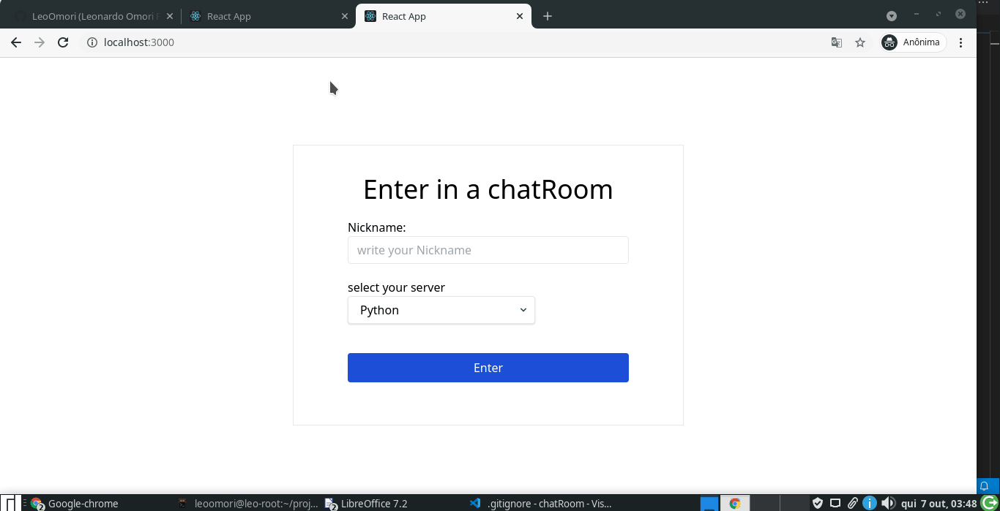

# chatRoom
chat aplication with nodejs and reactjs


## 💻 Tecnologias

* Nodejs
* ReactJS
* Tailwind
* Socket.io


## 🚀 Instalando 


BackEnd:
```
cd backEnd
npm i
npm run dev
```
front end:

```
cd frontEnd
npm i 
npm start
```

